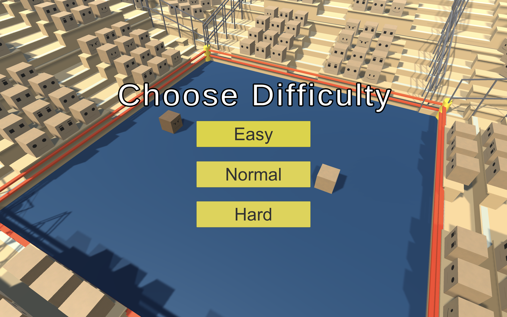
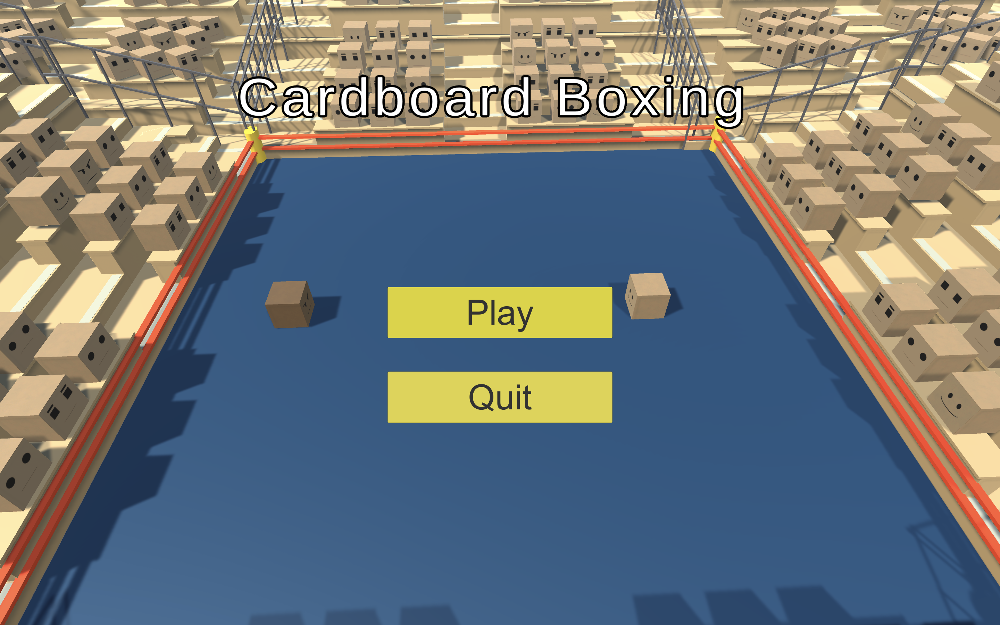

# Cardboard Boxing

## Description

Cardboard Boxing is an entertaining game crafted using the C# programming language. You'll enter the ring to face off against formidable opponents, all while in a dynamic gameplay environment. Be ready for intense boxing matches and be on the lookout for randomly appearing power-ups that can completely alter the course of the game.

## Key Features

- Engage in boxing matches against cardboard box opponents.
- Experience unpredictable power-ups.

### Power-Ups

- **Yellow**: Basic power-up that increases health and strength.
- **Red**: Turns the box into a ticking time bomb. Ram an opponent while activated to do boosted damage.
- **Orange**: Turns the box into a special delivery that does area of effect damage.
- **Black**: Drops explosive mines that launch the player or enemy.
- **Blue**: Freezes the opponent.
- **Green**: Grants 50 health.
- **Purple**: Spawns 3 minions that assist in combat.

## Game Controls

- **Movement**: Use `WASD` or Arrow Keys to move.
- **Dodge**: Press `Spacebar` to dodge.

## About the Project

This project represents my first step into game development and C# programming. The inspiration for this project came from the boxing scene found in this [YouTube clip](https://www.youtube.com/watch?v=Y7rw9gqfZow&ab_channel=TheSpongeFanatic). I remember watching it as a kid and wanted to bring it to a digital world. I thought it would be a fun way to introduce myself to Unity and also serves as a milestone in my ongoing exploration of game development.

Feel free to explore the codebase. Your feedback is highly appreciated as I continue to refine and expand this project. 
(code is in assets > scripts > c# files)

## How to Play

- **Play in Your Web Browser**: [Click Here ](https://play.unity.com/en/games/73368904-b323-45e5-a73e-c48d19f9d566/cardboardboxing)

## Preview

| Main Menu | Difficulty Selection |
|:---:|:---:|
|  |  |

| Gameplay |
|:---:
|  |

## Contact

If you have any questions, suggestions, or just want to connect, feel free to reach out to me:

- Email: areyanr@hotmail.com
